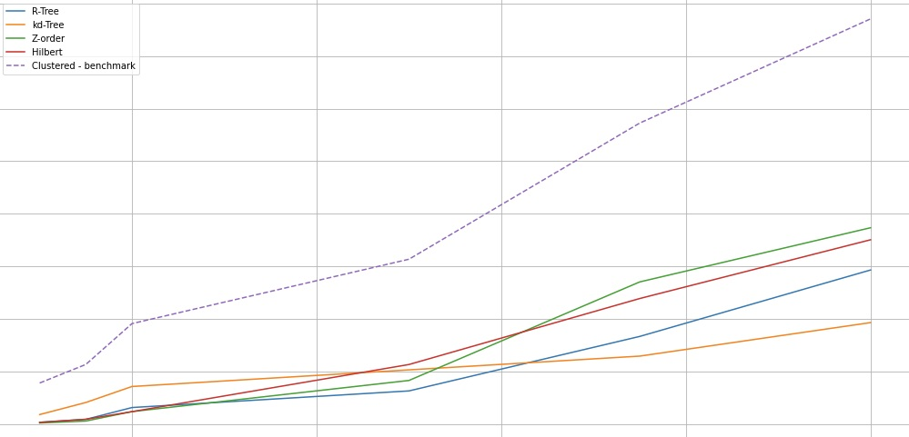

# Multidimensional-indexing

This repository contains a set of comparison tests between several popular multidimensional indexes.

The purpose is to benchmark the most popular implementations in Python programming language in order to serve as a baseline for a multidimensional Learned Index research efforts.

## Axis-anonimized results
